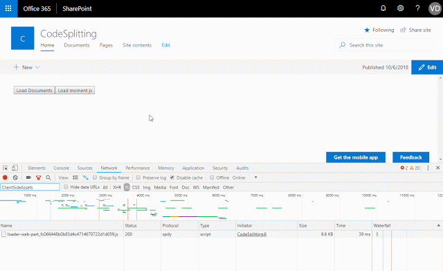

# Code Splitting in SharePoint Framework

## Summary
Load React components and third-party packages on demand in SPFx

## Used SharePoint Framework Version 

## Applies to

* [SharePoint Framework](https:/dev.office.com/sharepoint)
* [Office 365 tenant](https://dev.office.com/sharepoint/docs/spfx/set-up-your-development-environment)

## Solution

Solution|Author(s)
--------|---------
react-components-dynamicloading | Vardhaman Deshpande ([@vrdmn](https://twitter.com/vrdmn) , [vrdmn.com](http://vrdmn.com)) 

## Version history

Version|Date|Comments
-------|----|--------
1.0|October 09, 2018|Initial release

## Disclaimer
**THIS CODE IS PROVIDED *AS IS* WITHOUT WARRANTY OF ANY KIND, EITHER EXPRESS OR IMPLIED, INCLUDING ANY IMPLIED WARRANTIES OF FITNESS FOR A PARTICULAR PURPOSE, MERCHANTABILITY, OR NON-INFRINGEMENT.**

---

## Minimal Path to Awesome

- Clone this repository
- in the command line run:
  - `npm install`
  - `gulp serve`

## Features
More details included in this blog post: https://www.vrdmn.com/2018/10/code-splitting-in-sharepoint-framework.html

