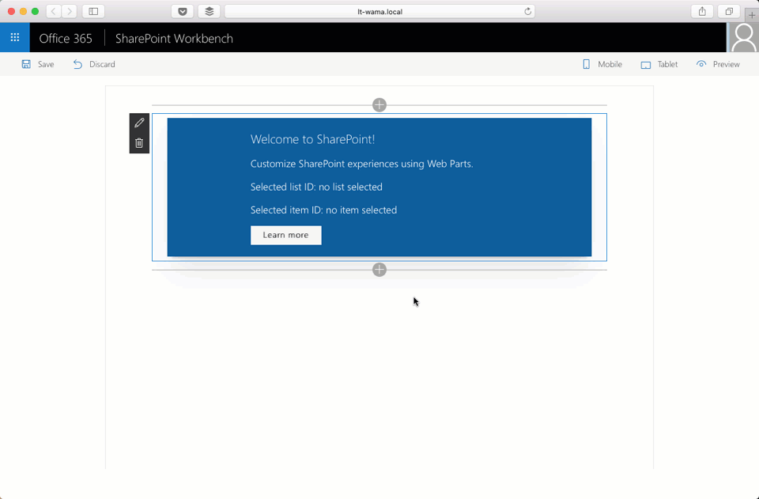
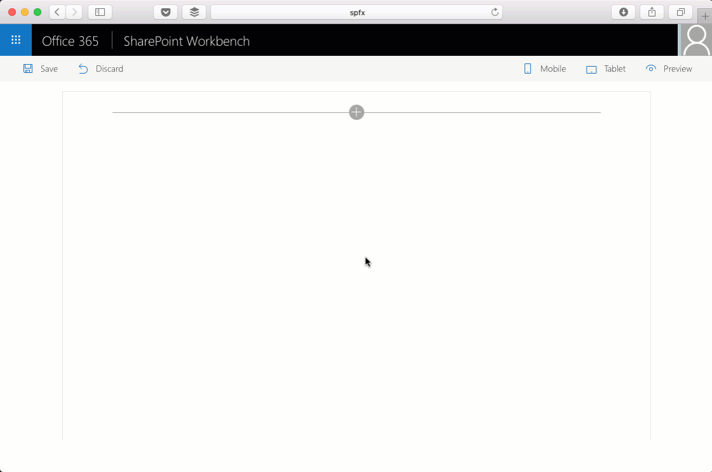

# Custom property pane controls built in React

## Summary

Sample custom property pane controls built in React for use with SharePoint Framework client-side web parts.

### Asynchronous drop-down

Drop-down that loads its options asynchronously.

This control supports promises and chaining for cascading drop-downs where value from one field determines values in other drop-down fields.

### Drop-down with external data without using a custom control

Cascading drop-downs in the property pane both using external data.

## Used SharePoint Framework Version

## Applies to

* [SharePoint Framework Developer Preview](http://dev.office.com/sharepoint/docs/spfx/sharepoint-framework-overview)
* [Office 365 developer tenant](http://dev.office.com/sharepoint/docs/spfx/set-up-your-developer-tenant)

## Solution

Solution|Author(s)
--------|---------
react-custompropertypanecontrols|Waldek Mastykarz (MVP, Rencore, @waldekm)

## Version history

Version|Date|Comments
-------|----|--------
2.0.1|May 1, 2017|Updated to SPFx GA
2.0.0|November 22, 2016|Added new sample web part (Dropdown with remote data (without custom controls))
1.0.0|October 17, 2016|Initial release

## Disclaimer
**THIS CODE IS PROVIDED *AS IS* WITHOUT WARRANTY OF ANY KIND, EITHER EXPRESS OR IMPLIED, INCLUDING ANY IMPLIED WARRANTIES OF FITNESS FOR A PARTICULAR PURPOSE, MERCHANTABILITY, OR NON-INFRINGEMENT.**

---

## Minimal Path to Awesome

- clone this repo
- `$ npm i`
- `$ gulp serve nobrowser`

### Asynchronous drop-down

By default the control uses mock data. If you want to test the control with SharePoint, change the commented sections in the **DropdownWithRemoteDataWebPart.ts** file inside the **loadLists** and **loadItems** functions and deploy the sample web part to your SharePoint developer tenant.

### Drop-down with external data without using a custom control

By default the web part uses mock data. If you want to test it with SharePoint, change the commented sections in the **DropdownWithRemoteDataWithoutCustomControlsWebPart.ts** file inside the **loadLists** and **loadItems** methods and deploy the sample web part to your SharePoint tenant.

## Features

Sample web parts in this solution illustrate the following concepts on top of the SharePoint Framework:

- using React for building custom property pane controls for use with SharePoint Framework client-side web parts
- building custom property pane controls using TypeScript
- updating web part properties from custom property pane controls
- linking multiple custom property pane controls together
- loading data for use in custom property pane controls asynchronously without blocking the web part
- forcing React components to repaint using an external trigger
- displaying a custom loading indicator
- reacting to web part property changes
- updating properties of web part property pane controls
- refreshing the web part property pane from the web part

