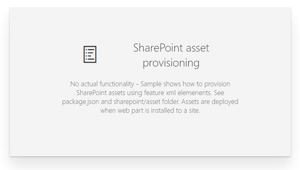

# Deployment of SharePoint assets as part of SPFx package

## Summary
Simplistic solution demonstrating how to provision SharePoint assets using Feature Framework elements when SharePoint Framework solution is being deployed to a SharePoint site. 

Demonstrated assets getting deployed to SharePoint site are following

- Fields
- Content Type
- List with custom schema

When you install SPFx so site, web scoped feature is activated and associated element.xml files are being processed. Technically you could also provision SharePoint assets using JavaScript, but it is limited to context of the current user using that component. If the user doesn't have sufficient permissions to create or modify SharePoint items, the JavaScript code will not provision those items. 

More details on the capability is available from the following article

* [Provision SharePoint assets with your solution package](https://dev.office.com/sharepoint/docs/spfx/toolchain/provision-sharepoint-assets)

## Used SharePoint Framework Version 

## Applies to

* [SharePoint Framework](https://blogs.office.com/2017/02/23/sharepoint-framework-reaches-general-availability-build-and-deploy-engaging-web-parts-today/)
* [Office 365 tenant](https://dev.office.com/sharepoint/docs/spfx/set-up-your-development-environment)

## Prerequisites
 
None.

## Solution

Solution|Author(s)
--------|---------
react-feature-framework | Vesa Juvonen

## Version history

Version|Date|Comments
-------|----|--------
1.0|February 27, 2017|Initial sample

## Disclaimer
**THIS CODE IS PROVIDED *AS IS* WITHOUT WARRANTY OF ANY KIND, EITHER EXPRESS OR IMPLIED, INCLUDING ANY IMPLIED WARRANTIES OF FITNESS FOR A PARTICULAR PURPOSE, MERCHANTABILITY, OR NON-INFRINGEMENT.**

---

## Minimal Path to Awesome

- Clone this repository
- Move to /samples/react-feature-framework folder
- in the command line run:
  - `npm install`
  - `gulp bundle`
  - `gulp package-solution`
- Install `react-feature-framework.sppkg` from `/sharepoint/solution` to app catalog in your tenant
- Install solution to SharePoint site

Following items are being provisioned

- SPFxAmount and SPFxCostCenter fields under 'SPFx Columns' group - visible in the Site Column Gallery
- Cost Center content type using 'SPFx Content Types' group using custom fields - visible in Site Content Types Gallery
- List called 'SPFx List' using custom schema.xml file using custom content type - visible in site contents page

