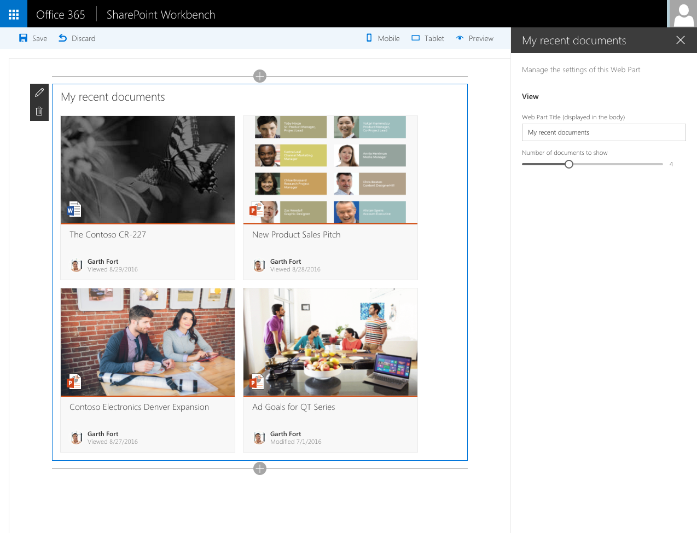
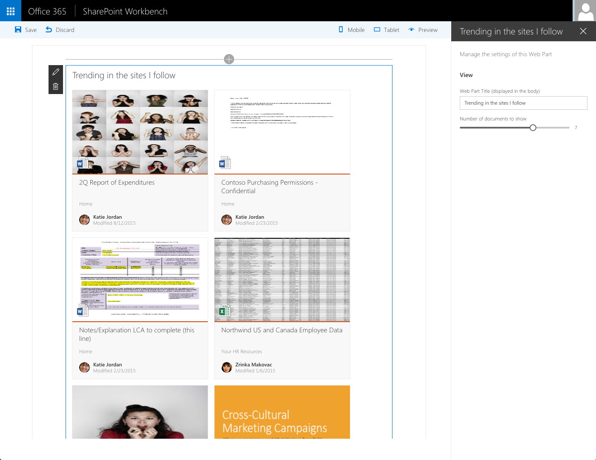

# React & Office Graph Web Part samples

> ## DEPRECATED
> This sample makes use of deprecated or otherwise outdated packages and will no longer work. See issue [#358](https://github.com/SharePoint/sp-dev-fx-webparts/issues/358) for more information.

## Summary

Sample SharePoint Framework Client-Side Web Parts built using React showing interacting with the Office Graph.

### Trending in this site

Sample SharePoint Framework Client-Side Web Part built using React showing documents trending in the current site.

### Working with

Sample SharePoint Framework Client-Side Web Part built using React showing people with whom the current user has recently been working with.

### My recent documents

Sample SharePoint Framework Client-Side Web Part built using React showing documents recently viewed or modified by the current user.

### Trending in the sites I follow

Sample SharePoint Framework Client-Side Web Part built using React showing documents trending in the sites followed by the current user.

## Used SharePoint Framework Version 

## Applies to

* [SharePoint Framework Developer Preview](http://dev.office.com/sharepoint/docs/spfx/sharepoint-framework-overview)
* [Office 365 developer tenant](http://dev.office.com/sharepoint/docs/spfx/set-up-your-developer-tenant)

## Solution

Solution|Author(s)
--------|---------
react-officegraph|Waldek Mastykarz (MVP, Rencore, @waldekm), Gautam Sheth(SharePoint Consultant,Rapid Circle,@gautamdsheth)

## Version history

Version|Date|Comments
-------|----|--------
2.0  |May 31, 2017| GA release
1.3.0|September 20, 2016|Added the Trending in the sites I follow sample
1.2.0|September 20, 2016|Added the My recent documents sample
1.1.0|September 19, 2016|Added the Working with sample
1.0.0|September 9, 2016|Initial release

## Disclaimer
**THIS CODE IS PROVIDED *AS IS* WITHOUT WARRANTY OF ANY KIND, EITHER EXPRESS OR IMPLIED, INCLUDING ANY IMPLIED WARRANTIES OF FITNESS FOR A PARTICULAR PURPOSE, MERCHANTABILITY, OR NON-INFRINGEMENT.**

---

## Prerequisites

- SharePoint Online tenant with Office Graph content
- Site Collection created under the **/sites/** Managed Path

## Minimal Path to Awesome

- clone this repo
- `$ npm i`
- `$ gulp serve --nobrowser`
- create a copy of the **./temp/workbench.html** file and change its extension to **.aspx**
- in the contents of the **workbench.aspx** file change the URL of the **webAbsoluteUrl** property to the URL of your site, eg. `https://contoso.sharepoint.com/sites/my-team`
- upload the **workbench.aspx** file to the Document Library in your site
- navigate to the workbench page uploaded to your SharePoint site, i.e. _https://contoso.sharepoint.com/sites/my-team/documents/workbench.aspx_

## Features

Sample Web Parts in this solution illustrate the following concepts on top of the SharePoint Framework:

- using React for building SharePoint Framework Client-Side Web Parts
- using Office UI Fabric React components for building user experience consistent with SharePoint and Office
- communicating with SharePoint using its REST API
- communicating with the Office Graph via the SharePoint Search REST API
- passing Web Part properties to React components
- using ES6 Promises with vanilla-JavaScript web requests

