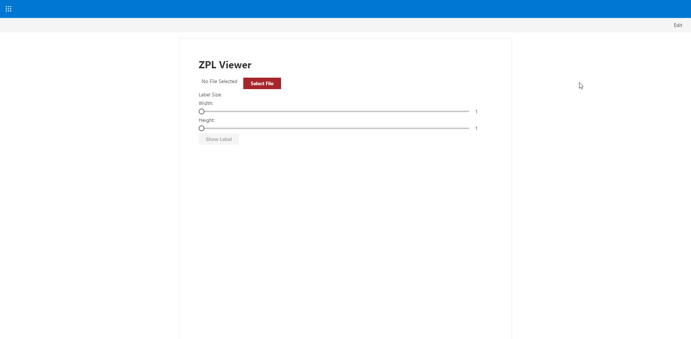

# react-zpl-viewer

## Summary

This webpart will allow a user to select a text file contatining zpl which is used to generate an image using the [labelary web service](http://labelary.com/service.html) to render the zpl and return the image.

## Used SharePoint Framework Version

## Applies to

* [SharePoint Framework](https:/dev.office.com/sharepoint)
* [Office 365 tenant](https://dev.office.com/sharepoint/docs/spfx/set-up-your-development-environment)

## Solution

Solution|Author(s)
--------|---------
react-zpl-viewer | Zach Roberts [spodev](https://spodev.com)

## Version history

Version|Date|Comments
-------|----|--------
1.0|February 13, 2020|Initial release

## Disclaimer

**THIS CODE IS PROVIDED *AS IS* WITHOUT WARRANTY OF ANY KIND, EITHER EXPRESS OR IMPLIED, INCLUDING ANY IMPLIED WARRANTIES OF FITNESS FOR A PARTICULAR PURPOSE, MERCHANTABILITY, OR NON-INFRINGEMENT.**

---

## Minimal Path to Awesome

* Clone this repository
* in the command line run:
  * `npm install`
  * `gulp serve --nobrowser`
* Browse to the workbench `https://yourtenant.sharepoint.com/sites/yoursite/_layout/15/workbench.aspx` and add the webpart

## Features

This webpart allows a user to select a text file containing zpl which then the contents of the selected file are read and the user is also able to configure the size of the label they would like to see in the render. When the user clicks the show label button the label is generated using an online server to render the image.

* [PnP SPFx React Controls - File Selector](https://sharepoint.github.io/sp-dev-fx-controls-react/)
* [PnP JS - Read Contents of a file](https://pnp.github.io/pnpjs/)

